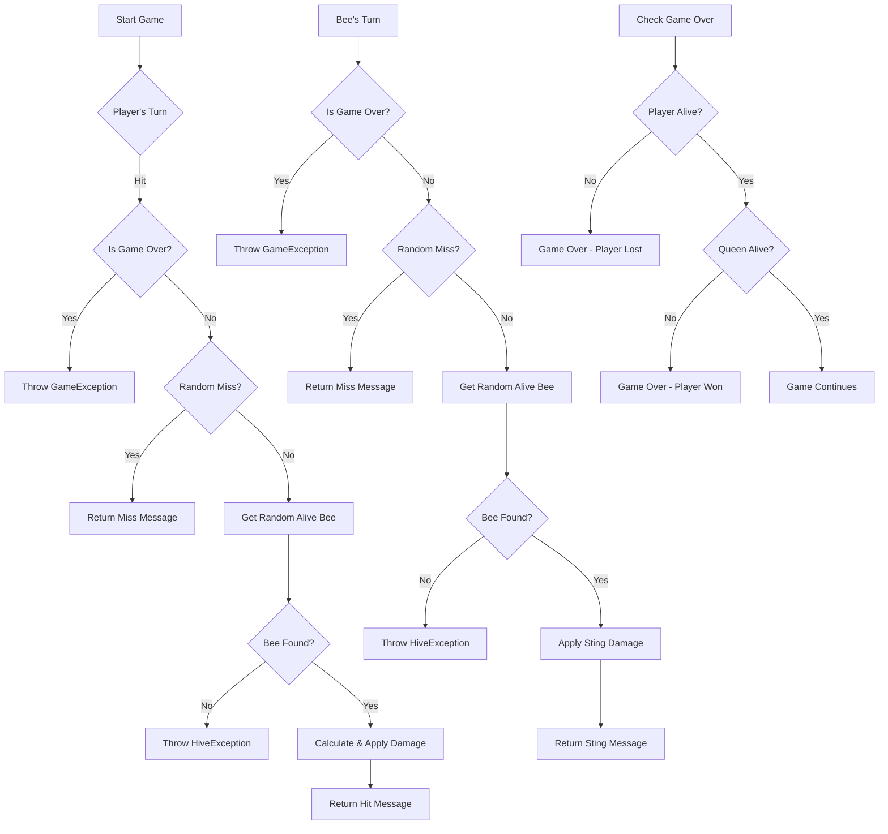

# Bees in the Trap

A command-line game where you battle against a hive of bees! Try to defeat the queen bee while avoiding getting stung too many times.

## Repository

This game is available at: https://github.com/tzone85/bees-cli-game

### Getting Started

To get a local copy up and running, follow these steps:

1. Clone the repository:
```bash
git clone https://github.com/tzone85/bees-cli-game.git bees
cd bees
```

2. Install dependencies:
```bash
composer install
```

## Project Structure

```
bees/
├── bin/
│   └── beesinthetrap      # Command-line entry point
├── src/
│   ├── Entities/
│   │   ├── Bee.php
│   │   ├── QueenBee.php
│   │   ├── WorkerBee.php
│   │   ├── DroneBee.php
│   │   └── Player.php
│   ├── Exceptions/        # Custom exceptions
│   │   ├── GameException.php
│   │   └── HiveException.php
│   └── Game/             # Game mechanics
│       ├── Game.php
│       └── Hive.php
├── tests/                # Test suite
│   └── Game/
│       └── GameTest.php  # Game logic tests
├── composer.json
├── phpunit.xml
└── README.md
```

## Game Flow

Here's a visual representation of the game's flow and mechanics:



If you don't have Mermaid support in your Markdown viewer, you can see the flow diagram here:


## Installation

1. Ensure you have PHP 8.1 or higher installed
2. Clone this repository
3. Run `composer install`

## Running the Game

```bash
./bin/beesinthetrap
```

Or run in auto mode:

```bash
./bin/beesinthetrap --auto
```

## Testing

Run the test suite:

```bash
./vendor/bin/phpunit tests
```

## Game Rules

- You start with 100 HP
- Each turn you can hit the hive, targeting a random bee
- Different bees take different amounts of damage:
  - Queen: 10 damage
  - Worker: 25 damage
  - Drone: 30 damage
- Bees will try to sting you each turn
- There's a 30% chance of missing for both you and the bees
- The game ends when either:
  - You defeat the Queen Bee (victory!)
  - Your HP reaches 0 (defeat!)

A command-line game where you must destroy a hive of bees before they sting you to death!

## Requirements

- PHP 8.1 or higher
- Composer

## Installation

1. Clone the repository
2. Run `composer install`
3. Make the game executable: `chmod +x bin/beesinthetrap`

## How to Play

Run the game:

```bash
./bin/beesinthetrap
```

For auto-play mode:

```bash
./bin/beesinthetrap --auto
```

## Game Rules

- You start with 100 HP
- Type 'hit' to attack the hive
- The hive contains:
  - 1 Queen Bee (100 HP, deals 10 damage)
  - 5 Worker Bees (75 HP each, deal 5 damage)
  - 25 Drone Bees (60 HP each, deal 1 damage)
- When you hit a bee:
  - Queen Bee takes 10 damage
  - Worker Bee takes 25 damage
  - Drone Bee takes 30 damage
- When the Queen Bee dies, all remaining bees die
- There's a 30% chance to miss for both player and bees
- Game ends when either you or all bees are dead

## Running Tests

```bash
./vendor/bin/phpunit tests
```
